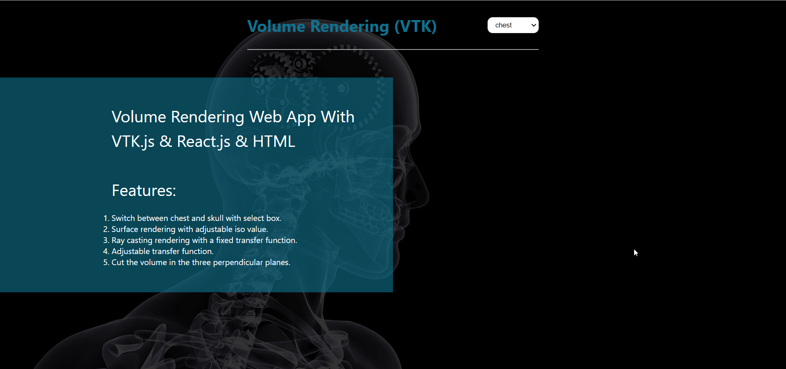

# 3D medical viewer built with vtk-js & Reactjs
- [ِApp Objectives](#App_Objectives)
- [Demos](#Demos)
    - [Chest](#Chest)
    - [Skull](#Skull)
- [Team Members](#Team_Members)
- [Run-App](#Run-App)  
------
## App_Objectives
### Running Examples From VTK Website
After installing React and Node.js we have run the examples from the vtk website.

### Building Web GUI
We Created a react project with two main files one for the Skull Code and the other for the Chest Code. We connected the two main files through a Home page that enabled us to move from one example to the other. We created the Home page with some HTML And CSS code to make it a little Functional. We made it available to move from one example to another through one tab.
We choosed this way to enable us to add another example in a simple way through adding its file and add acomponent for it in home page.

### Linking Two Examples(Skull & Chest)
We linked the two examples though a combobox we created in the home page and made it available to move from one example to another and vice verse without any need to return to the Home page.

### Croping, Ray Casting and Transfer function in chest
You can crop any part you want from chest through some points. You also can control which points you want to show and control them through some checkboxes on the lef of page.
We also added the adjustable transfer function feature for the chest.

### Surface rendering with adjustable iso value for skull example.

------
## Demos
### Chest

### Skull

-----
## Team_Members
| Name         |
|--------------|
| Ahmed Gamil |
| Mohamed zakaria hussen    | 
| Mohamed reda fathy |
| Hesham gamal shaaban     |

## Run-App
**Run the Web App**
- After clone the App ,go to the directory of the App
```sh
 npm start
```

